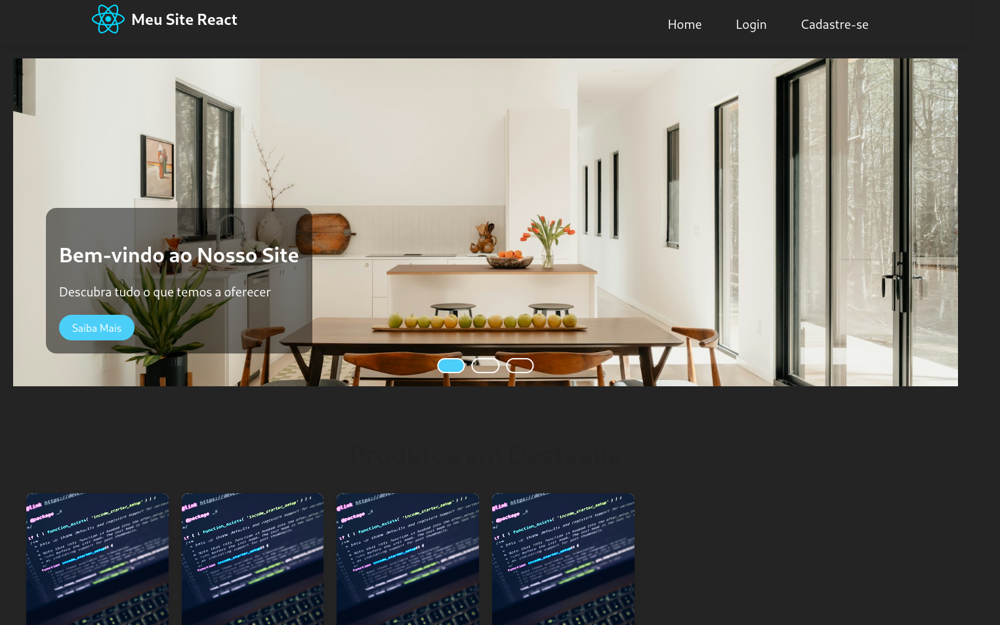

# Meu Site Full Stack com React Vite
)

Um site simples desenvolvido com React Vite, contendo todos os componentes solicitados pelo professor: NavBar, Footer, Carrossel, seção de imagens, páginas de Login e Cadastro.

## ✨ Funcionalidades

- **Navegação responsiva** com NavBar estilizada
- **Carrossel automático** com transições suaves e controles manuais
- **Página Home** com seção de produtos e sobre nós
- **Sistema de autenticação** com páginas de Login e Cadastro
- **Footer completo** com informações de contato e links sociais
- **Design responsivo** que se adapta a diferentes tamanhos de tela
- **Organização modular** com componentes e estilos separados

## 🚀 Como Executar o Projeto

### Pré-requisitos

- Node.js (versão 16 ou superior)
- npm ou yarn

### Instalação

1. Clone o repositório:

```bash
git clone https://github.com/Vinishireis/Modelo_de_Site_React_Vite.git
cd my-react-site
```

2. Instale as dependências:

```bash
npm install
# ou
yarn install
```

3. Execute o servidor de desenvolvimento:

```bash
npm run dev
# ou
yarn dev
```

O projeto estará disponível em [http://localhost:5173](http://localhost:5173)

### Build para Produção

Para criar uma versão otimizada para produção:

```bash
npm run build
# ou
yarn build
```

## 📂 Estrutura de Arquivos

```
meu-site-fullstack/
├── public/                  # Arquivos públicos
│   ├── images/              # Imagens do projeto
│   │   ├── carousel1.jpg    # Imagem 1 do carrossel
│   │   ├── carousel2.jpg    # Imagem 2 do carrossel
│   │   ├── carousel3.jpg    # Imagem 3 do carrossel
│   │   ├── logo.png         # Logo do site
│   │   └── placeholder.jpg  # Imagem padrão
├── src/
│   ├── components/          # Componentes reutilizáveis
│   │   ├── Carrossel/       # Componente do carrossel
│   │   ├── Footer/          # Componente do footer
│   │   └── NavBar/          # Componente da barra de navegação
│   ├── pages/               # Páginas do site
│   │   ├── Home/            # Página inicial
│   │   ├── Login/           # Página de login
│   │   └── Register/        # Página de cadastro
│   ├── App.jsx              # Componente principal
│   └── main.jsx             # Ponto de entrada
├── .gitignore
├── package.json
├── README.md                # Este arquivo
└── vite.config.js           # Configuração do Vite
```

## 🛠 Tecnologias Utilizadas

- [React](https://reactjs.org/) - Biblioteca JavaScript para construção de interfaces
- [Vite](https://vitejs.dev/) - Ferramenta de build rápida para front-end
- [React Router](https://reactrouter.com/) - Gerenciamento de rotas
- [CSS Modules](https://github.com/css-modules/css-modules) - Estilização modular
- [Font Awesome](https://fontawesome.com/) - Ícones (via CDN)

## 👨‍💻 Autor

**Vinícius Nishimura Reis**

- GitHub: [@Vinishireis](https://github.com/Vinishireis)
- LinkedIn: [Vinícius Nishimura Reis](https://www.linkedin.com/in/vinicius-nishimura-reis/)


## 🙏 Agradecimentos

- Ao meu professor Francisco de Desenvolvimento Full Stack pela orientação
